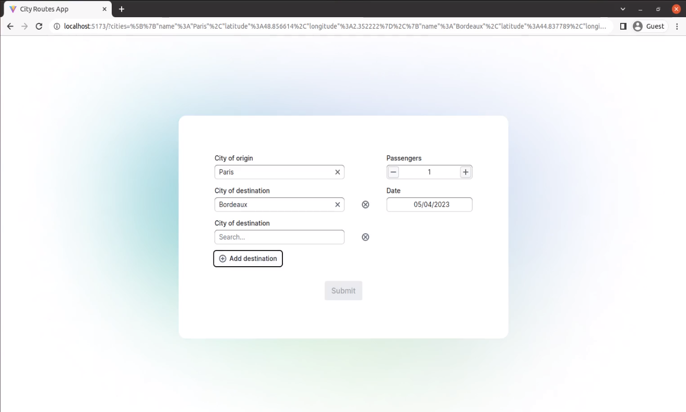

# [City Route App](https://city-routes-app.vercel.app/) &middot;   

## Summary

This app will allow people to perform searches to know the distance of a route that may consist of 2 or more cities, to enable them to plan their travel.

- Imagine that the backend API can NOT return you the full list of cities, and you’ll need to search the cities with a keyword.

- The app should consist of two pages: the search form (home page) and the search results.

## Features:

- Fully support for [**TDD and CI/CD**](#the-application-is-built-in-tdd-way-and-fully-support-for-cicd)
- Advanced custom UI components, [**Async Select, Positive Numeric Input**](#pages--custom-ui-components)
- Support [**Deep Linking**](#the-application-fully-support-for-deep-linking)
- Advanced Form features: Validations, Dynamic Fields, Interactions using both keyboard and mouse
- [**Vite**](https://vitejs.dev/) project setup

## Pages & Custom UI Components

- **Search Form Page**

  

- **Async City Select**

  - **Loading Skeleton**
    

  - **Select an item using both mouse and keyboard**
    

  - **Add/Remove a city select control(Dynamic Fields Support)**
    

  - **Error Handling**

    - When a user type `"fail"`, the mock async API for fetching cities throws an error and the component shows the corresponding error mesasge.

      

    - When one of the selected cities is `"Dijon"`, the mock async API for calculating the distances throws an error and search result page shows the error.

      
      

- **Positive Integer Input**

  - Extends [Blueprint's Numeric input](https://blueprintjs.com/docs/#core/components/numeric-input) by adding the following features:

    - Add `Increase/Decrease` button on the both sides.
    - Only allows input of positive numbers.
      <br /><br />
      

- **Date Input**

  

- **Search Results Page**

  - **Loading Spinner while fetching API data**
    
  - **Haversine distance results**
    

- **On the home page** there is a search form. The form consists of the following fields:

  1. **City of origin**: Required to fill. A searchable dropdown (combo box) with a list of cities. The list of cities should be requested and searched asynchronously with the loading indication.

  2. **Intermediate cities**: Same as **City of origin**. There should be a way to add/remove multiple intermediate cities. No intermediate cities should be shown when the page is first loaded. If an intermediate city is added it has to be filled.

  3. **City of destination**: Required to fill. Same as **City of origin**.

  4. **Date of the trip**: Required to fill. Should be a date in the future.

  5. **Number of passengers** Required to fill. Should be a number greater than 0.

  - The form is validated. If some field has an invalid value, the error is shown around the problematic field and the submit button is disabled. The submit button when clicked navigate to the search results page.

  - The home page allow **deep-linking**: form data is stored in the URL, so when a user copy and share the link, the form can be pre-filled with the data from the URL parameters.

- **On the search results page** all the fields filled on the home page are displayed. The distance of the route (in kilometers) is calculated and displayed: between subsequent cities of the route and the total distance. The distance calculation is performed asynchronously with loading indication and error handling.

- The search results page take all parameters from the URL, meaning that the link to a particular search result can be shared with others.

## Technical Specification

### The application is built in **TDD** way and fully support for **CI/CD**

- **Unit Testing**

  - [**Vitest**](https://vitest.dev/)
  - [**React Testing Library**](https://testing-library.com/docs/react-testing-library/intro/)

- **End-to-End Testing**

  - [**Cypress**](https://www.cypress.io/)

- **CI/CD**
  - [GitHub Actions](https://github.com/features/actions)

### The application fully support for Deep-Linking

- [**A Custom Hook**](/src/hooks/useCitySearchParams.ts) is used for enabling **deep-linking** across the pages

### The application is implemented as a SPA (Single Page Application) using **React** and **TypeScript**.

- [**Blueprint**](https://blueprintjs.com/), a React-based UI toolkit for the web is used to speed up the development and app quality.
- [**React Hook Form**](https://react-hook-form.com/) is used for form state management and validation.

### To implement a `cities` database, I hardcoded the list of cities and simulate the delay of requesting the cities.<br />

You can find an example list of cities in the [Appendix A](#appendix-a).<br/>

The fake backend has `two endpoints(functions)`.

- The first endpoint receives a `keyword` and returns `a list of cities` that match the keyword.

- The second endpoint receives a `list of cities` and calculates the `distances`.

- When a user attempts to find cities using the phrase `“fail”` (case-insensitive), the mocked API fail to return results to demonstrate the error handling abilities of the UI.

- To implement the distance calculation, I used [**Haversine distance formula**](https://en.wikipedia.org/wiki/Haversine_formula) and simulate the delay of the calculation.

- When `“Dijon”` city is involved, the distance calculation fails to demonstrate the error handling abilities of the UI.

## Appendix A

- **Cities of France**

  - **Fields**: **_Name_**, **_Latitude_**, **_Longitude_**

  - **JSON data**:

    ```json
    [
      { "name": "Paris", "latitude": 48.856614, "longitude": 2.352222 },

      { "name": "Marseille", "latitude": 43.296482, "longitude": 5.36978 },

      { "name": "Lyon", "latitude": 45.764043, "longitude": 4.835659 },

      { "name": "Toulouse", "latitude": 43.604652, "longitude": 1.444209 },

      { "name": "Nice", "latitude": 43.710173, "longitude": 7.261953 },

      { "name": "Nantes", "latitude": 47.218371, "longitude": -1.553621 },

      { "name": "Strasbourg", "latitude": 48.573405, "longitude": 7.752111 },

      { "name": "Montpellier", "latitude": 43.610769, "longitude": 3.876716 },

      { "name": "Bordeaux", "latitude": 44.837789, "longitude": -0.57918 },

      { "name": "Lille", "latitude": 50.62925, "longitude": 3.057256 },

      { "name": "Rennes", "latitude": 48.117266, "longitude": -1.677793 },

      { "name": "Reims", "latitude": 49.258329, "longitude": 4.031696 },

      { "name": "Le Havre", "latitude": 49.49437, "longitude": 0.107929 },

      { "name": "Saint-Étienne", "latitude": 45.439695, "longitude": 4.387178 },

      { "name": "Toulon", "latitude": 43.124228, "longitude": 5.928 },

      { "name": "Angers", "latitude": 47.478419, "longitude": -0.563166 },

      { "name": "Grenoble", "latitude": 45.188529, "longitude": 5.724524 },

      { "name": "Dijon", "latitude": 47.322047, "longitude": 5.04148 },

      { "name": "Nîmes", "latitude": 43.836699, "longitude": 4.360054 },

      {
        "name": "Aix-en-Provence",
        "latitude": 43.529742,
        "longitude": 5.447427
      }
    ]
    ```
